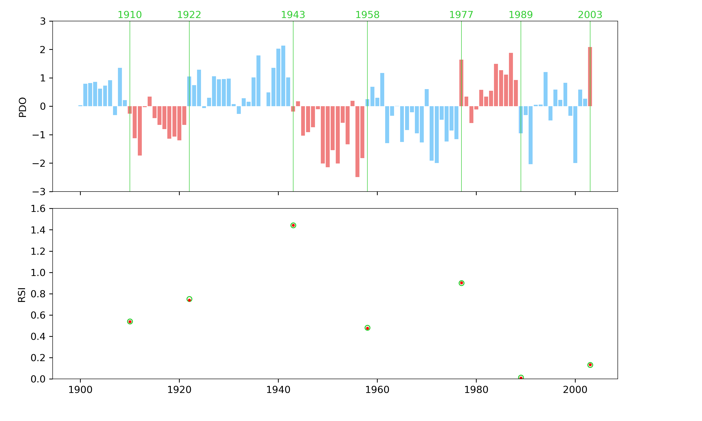

# Rodionov_STARS
A command line implementation of the Student's t-test for the Analysis of Regime Shifts (STARS)

The STARS algorithm aims to identify regime changes in time series data. It is described in detail by Rodionov (2004). Many implementations of this algorithm are available online, notably from the author in the form of a [Microsoft Excel plugin](https://www.beringclimate.noaa.gov/regimes/). The objective of this implementation, is to provide a tool that can be used by collaborators familiar with different programming langagues, as long as they are familiar with the Linux shell and have a basic Python installation. For Python users, it can also be imported into scripts as a module.

## Installation

For users without a Python installation, a convenient way to install all the needed dependencies is install via [Anaconda](https://www.anaconda.com/download). Otherwise, ensure that the following modules are installed to your system (or virtual environment):

* Scipy
* Numpy
* Pandas
* Matplotlib
* Argparse
* os

Once Python is installed, clone this repository into your Python path. Typically, with an Anaconda install, this would be done in one of the following locations:

```python
/path/to/Anaconda/lib/pythonX.X/site-packages/
/path/to/Anaconda/envs/environment_name/lib/pythonX.X/site-packages/
```

To test the installation, you can run the validation script, which reproduces the results from the algorithm example shown in Rodionov (2004) using the Pacific Decadal Oscillation (PDO) January index.

```python
$ python rodionov_stars_validation.py
```

This should create the image file `rodionov_stars_validation.png`. RSI values from the paper and those from this module are shown by green circles, and red dots respectively. The regime change years identified in the paper are shown by vertical green lines and the regimes identified by this module are shown by alternating blue and red bar colors. 



## Usage

### Data preparation

From the command line, this script ingests comma-separated column ASCII files (1 or more columns). By default, it runs on the leftmost column of the file, but this can be changed via the `-c, --data-column` option flag. The time column can also be supplied (`-t, --time-column` option flag), but is mostly usefull if using the plot option flag (`-P`). Otherwise, a single column file containing only the data in which to detect regime shifts will work normally.

This implementation assumes that:

* Along the time axis, data are regularly spaced
* There are no missing data in the time series
* There are no bad values in the time series

If any of these conditions are not met, users should cautiously interpret the output results.

### Command line example

Consider the following command which illustrates most of the functionality of this module by identifying the regime shifts in the Rodionov (2004) PDO example data.

```python
$ python rodionov_stars.py data/rodionov_2004_figure_2_PDO.csv example_output.csv -c 1 -t 0 -l 10 -p 0.05 -P
```

The python interpreter is called on the main script. There are 2 mandatory positional arguments: the input file path and name, and the output file path and name. Then, we specify that the PDO data is in the second column from the left (`-c 1`) and the time data is in the leftmost column (`-t 0`). The regime cut-off length and probability parameters (Rodionov, 2004) are then set to 10 and 0.05, respectively, and we ask the script to plot our results. 

The output results are formatted as a comma-separated ASCII file whose columns represent

* The regime shift index (RSI) calculated at each time step
* The regime integer labels associated with each time step
* The regime mean used by the algorithm at each time step ($\bar{x}_{R1}$ parameter)
* The input data
* The input time axis (only included if `-t` was used)

and the `-P` option flag generates an image file with the same name as the output data file, but with a different extension (`example_output.png`).

## Notes

To obtain the same results as the published reference, the search for regime 2 begins at `i=1` instead of `i=l+1`, at the beginning of the algorithm loop. We also do not update the $\bar{x}_{R1}$ parameter unless the current value is more than `l` points away from the last regime change, otherwise RSI values at the beginning of each regime are mostly based on data from the previous regime. Note also that the rolling variance applied to calculate the $\sigma_l$ parameter is the biased/sample/divide-by-N variance, which is not specified in the original study.

## References

Rodionov, S.N. (2004) A sequential algorithm for testing climate regime shifts. Geophys. Res. Lett., 31, L09204, doi:10.1029/2004GL019448.
